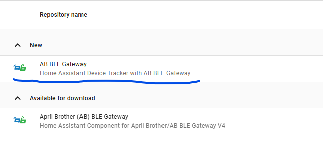
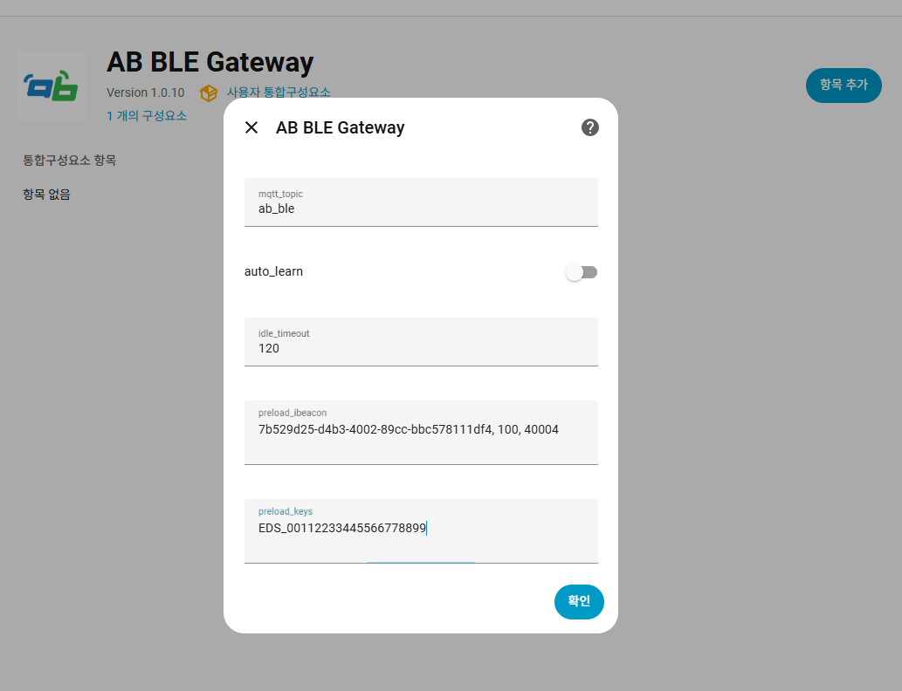

# AB BLE Gateway

MQTT 기반 BLE 스캐너 데이터를 Home Assistant의 `device_tracker`로 변환해 재실 상태를 추적하는 통합입니다.  
iBeacon / Eddystone / BLE MAC을 지원하고, Auto learn · Preload iBeacon · Preload Keys로 관리할 수 있습니다.

> ✅ HA 2025.11 / Python 3.13 에서 검증됨  
> ✅ 속성: `rssi`, `last_seen_seconds`, `uuid/major/minor`(iBeacon)

---

## 설치

### 1) HACS 커스텀 저장소 (권장)
1. HACS → Integrations → 우상단 `⋯` → **Custom repositories…**
2. **Repository**: `https://github.com/af950833/ab_ble_gateway` · **Category**: Integration → Add
3. HACS에서 `AB BLE Gateway` 검색 → Install
4. Home Assistant 재시작
5. 설정 → 기기 및 서비스 → 통합 추가 → `AB BLE Gateway`


### 2) 수동 설치
1. 이 저장소를 내려받아 `custom_components/ab_ble_gateway/`를
   HA의 `config/custom_components/ab_ble_gateway/`에 복사
2. Home Assistant 재시작 → 통합 추가

---

## 옵션

- **MQTT Topic**: 기본 `ab_ble` 이며 사용자가 변경 가능
- **Auto learn**: ON 시 수신된 비콘을 자동 등록(기본 OFF)
- **Idle timeout**: 마지막 수신 이후 N초가 지나면 `not_home` (기본 120초이며 생성되는 device_tracker 의 consider_home 은 0초로 기본 설정됨)
- **Preload iBeacon** (UUID, Major, Minor 형식으로 입력필요. 멀티라인/세미콜론 `;` 가능)
  ```
  25bc612c-334d-4618-a1ef-07e58a24e806, 100, 40004
  00112233445566778899AABBCCDDEEFF 10 20

  or
  
  25bc612c-334d-4618-a1ef-07e58a24e806, 100, 40004; 00112233445566778899AABBCCDDEEFF 10 20
  ```
  *Major/Minor는 10진 또는 16진(`0x` 접두 허용), 내부에서 4자리 HEX로 정규화*
- **Preload Keys** (완성 키 직접 입력. 공백, 줄바꿈, 쉼표로 멀티 입력 가능)
  ```
  IBC_7B439D25D4B3400289CCBBC578111D4E00649C44
  EDS_00112233445566778899
  AA:BB:CC:DD:EE:FF
  ```
- **Preload iBeacon & Preload Keys 는 수동으로 계속 추가 가능**

---

## MQTT 예시
```json
{
  "v":1,
  "mid":2041,
  "ip":"192.168.0.13",
  "mac":"C45BBE8E51D0",
  "devices":[[2,"6EC73B08599E",-66,"1AFF4C0002157B439D25D4B3400289CCBBC578111D4E00649C44C5"]],
  "rssi":-56
}
```
- iBeacon 헤더: `1AFF4C000215`
- 키 조합: `UUID(32)+Major(4)+Minor(4)` → `IBC_<uuid><major><minor>` (마지막C5 부분은 TX파워로 제외됨)

---

## 엔티티 네이밍
- iBeacon: `device_tracker.ble_ibc_<uuid><major4><minor4>`  
- Eddystone: `device_tracker.ble_eds_<namespace>`  
- MAC: `device_tracker.ble_<mac_without_colon>`

엔티티 속성 예:
```yaml
rssi: -52
last_seen_seconds: 1.4
uuid: 7B439D25D4B3400289CCBBC578111D4E
major: 0064
minor: 9C44
```

---

## 디버그
```yaml
logger:
  default: warning
  logs:
    custom_components.ab_ble_gateway: debug
```

---

## 변경 로그
- **1.0.0(2025/11/12)**
  - Initial Release
