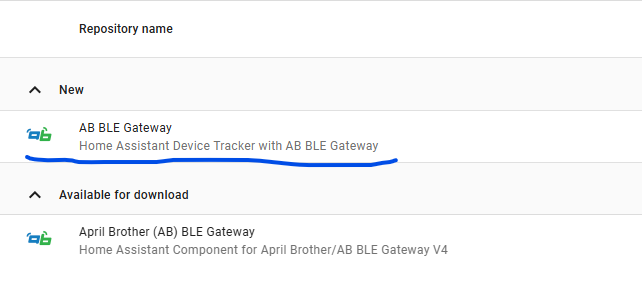
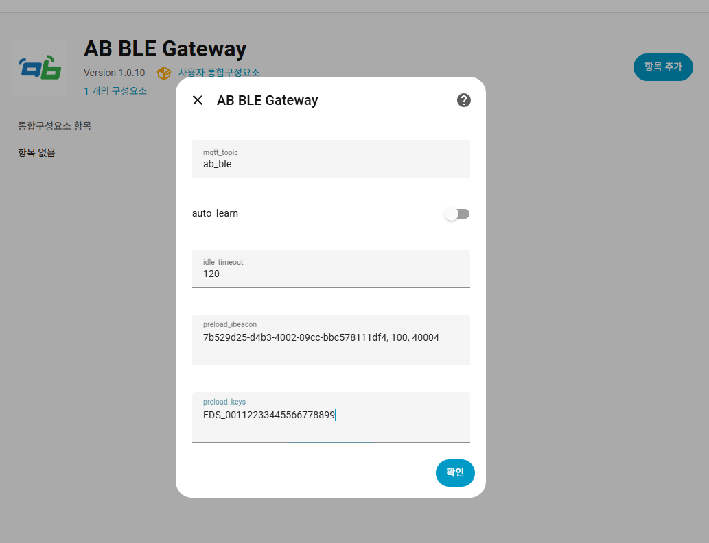

# AB BLE Gateway

MQTT 기반 BLE 스캐너 데이터를 Home Assistant의 `device_tracker`로 변환해 재실 상태를 추적하는 통합입니다.

iBeacon / Eddystone / BLE MAC / IRK 기반 Private BLE Device를 지원하고, Auto learn · Preload iBeacon · Preload IRK · Preload Keys로 관리할 수 있습니다.

> ✅ HA 2025.11 / Python 3.13 에서 검증됨  
> ✅ 속성: `rssi`, `last_seen_seconds`, `uuid/major/minor`(iBeacon), `irk/current_address/min_rssi`(IRK)

---

## 설치

### 1) HACS 커스텀 저장소 (권장)

1. HACS → Integrations → 우상단 `⋯` → **Custom repositories…**
2. **Repository**: `https://github.com/af950833/ab_ble_gateway`
3. **Category**: Integration → Add
4. HACS에서 `AB BLE Gateway` 검색 → Install
5. Home Assistant 재시작
6. 설정 → 기기 및 서비스 → 통합 추가 → `AB BLE Gateway`



### 2) 수동 설치

1. 이 저장소를 내려받아 `custom_components/ab_ble_gateway/`를 HA의 `config/custom_components/ab_ble_gateway/`에 복사
2. Home Assistant 재시작
3. 설정 → 기기 및 서비스 → 통합 추가 → `AB BLE Gateway`

---

## 옵션



- **MQTT Topic**: 기본 `ab_ble`이며 사용자가 변경 가능
- **Auto learn**: ON 시 수신된 비콘/기기를 자동 등록 (기본 OFF)
- **Idle timeout**: 마지막 유효 수신 이후 N초가 지나면 `not_home` (기본 120초)

### Preload iBeacon

iBeacon UUID, Major, Minor를 미리 등록합니다. 멀티라인 또는 세미콜론 `;` 구분을 지원합니다.

```text
25bc612c-334d-4618-a1ef-07e58a24e806, 100, 40004
00112233445566778899AABBCCDDEEFF 10 20
```

또는:

```text
25bc612c-334d-4618-a1ef-07e58a24e806, 100, 40004; 00112233445566778899AABBCCDDEEFF 10 20
```

Major/Minor는 10진 또는 16진(`0x` 접두 허용) 입력이 가능하며, 내부에서 4자리 HEX로 정규화됩니다.

### Preload IRK

iPhone / Apple Watch 등 Resolvable Private Address(RPA)를 사용하는 BLE 기기를 IRK로 추적합니다.

한 줄에 이름, IRK, 선택적 RSSI threshold를 입력합니다.

```text
iphone17 2197f02764b6e9327313812f9bdad176
iphone17 2197f02764b6e9327313812f9bdad176 -55
```

IRK는 32자리 HEX 또는 Home Assistant Private BLE Device/ESPresense에서 사용하는 base64 형식을 입력할 수 있습니다.

마지막에 `-55` 같은 RSSI threshold를 붙이면 해당 값 이상으로 강하게 수신될 때만 `home`으로 갱신합니다.

```text
RSSI >= -55  -> home 갱신
RSSI <  -55  -> 감지는 기록하지만 home 갱신 안 함
```

이 기능은 iPhone처럼 BLE 송신 출력을 조절하기 어렵고 RPA 주소가 주기적으로 바뀌는 기기를 고정 식별하기 위한 기능입니다.

IRK가 등록된 기기는 내부적으로 `IRK_<IRK>` 키로 관리되며, 엔티티 속성에 아래 값들이 표시될 수 있습니다.

```yaml
rssi: -48
last_seen_seconds: 1.2
irk: 2197F02764B6E9327313812F9BDAD176
min_rssi: -55
current_address: 5FE99B9FA3AB
last_weak_rssi: -68
```

### Preload Keys

완성된 키를 직접 입력합니다. 공백, 줄바꿈, 쉼표로 여러 개를 입력할 수 있습니다.

```text
IBC_7B439D25D4B3400289CCBBC578111D4E00649C44
EDS_00112233445566778899
AA:BB:CC:DD:EE:FF
```

`Preload iBeacon`, `Preload IRK`, `Preload Keys`는 옵션에서 계속 수동으로 추가/수정할 수 있습니다.

---

## MQTT 예시

```json
{
  "v": 1,
  "mid": 2041,
  "ip": "192.168.0.13",
  "mac": "C45BBE8E51D0",
  "devices": [
    [2, "6EC73B08599E", -66, "1AFF4C0002157B439D25D4B3400289CCBBC578111D4E00649C44C5"]
  ],
  "rssi": -56
}
```

- iBeacon 헤더: `1AFF4C000215`
- 키 조합: `UUID(32)+Major(4)+Minor(4)` → `IBC_`
- 마지막 TX Power 바이트는 키에서 제외됩니다.

iPhone Private BLE 예시:

```json
{
  "devices": [
    [0, "5FE99B9FA3AB", -48, "02011A0BFF4C001006791E4C8B1D8A020A00"]
  ]
}
```

IRK와 매칭되면 RPA 주소(`5FE99B9FA3AB`)가 바뀌어도 같은 `device_tracker`로 갱신됩니다.

---

## 엔티티 네이밍

- iBeacon: `device_tracker.ble_ibc_...`
- Eddystone: `device_tracker.ble_eds_...`
- MAC: `device_tracker.ble_...`
- IRK: `device_tracker.ble_<label>` (`preload_irk` 첫 번째 이름 기준)

iBeacon 엔티티 속성 예:

```yaml
rssi: -52
last_seen_seconds: 1.4
uuid: 7B439D25D4B3400289CCBBC578111D4E
major: 0064
minor: 9C44
```

IRK 엔티티 속성 예:

```yaml
rssi: -48
last_seen_seconds: 1.2
irk: 2197F02764B6E9327313812F9BDAD176
min_rssi: -55
current_address: 5FE99B9FA3AB
last_weak_rssi: -68
```

---

## iPhone / Private BLE 사용 팁

iPhone은 BLE MAC 주소가 주기적으로 바뀌는 RPA 방식을 사용합니다. 따라서 일반 MAC 주소로 추적하면 시간이 지나면서 다른 기기로 보일 수 있습니다.

안정적으로 추적하려면 IRK가 필요합니다.

IRK를 얻는 방법 예:

- Home Assistant `Private BLE Device` 문서의 방식
- ESPresense의 Enroll 기능
- macOS Keychain에서 Remote IRK 확인
- ESP32 기반 IRK capture 펌웨어

IRK를 등록한 뒤에는 `preload_irk`에 아래처럼 입력합니다.

```text
iphone17 2197f02764b6e9327313812f9bdad176 -55
```

도어락, 현관 자동화처럼 거리 조건이 중요한 경우 RSSI threshold를 함께 사용하는 것을 권장합니다.

---

## 디버그

```yaml
logger:
  default: warning
  logs:
    custom_components.ab_ble_gateway: debug
```

MQTT 원본 확인 예:

```bash
mosquitto_sub -h 192.168.0.4 -u homeassistant -P password -t ab_ble/# -v
```

Apple BLE payload만 보고 싶을 때:

```bash
mosquitto_sub -h 192.168.0.4 -u homeassistant -P password -t ab_ble/# -v | grep FF4C00
```

iPhone Continuity 계열 payload만 좁혀 보고 싶을 때:

```bash
mosquitto_sub -h 192.168.0.4 -u homeassistant -P password -t ab_ble/# -v | grep FF4C001006
```

---

## 변경 로그

- **1.0.0 (2025/11/12)**
  - Initial Release

- **1.1.0 (2026/07/05)**
  - IRK 기반 Private BLE Device 추적 추가
  - iPhone RPA 매칭 지원
  - IRK별 RSSI threshold 지원
  - `current_address`, `min_rssi`, `last_weak_rssi` 속성 추가
